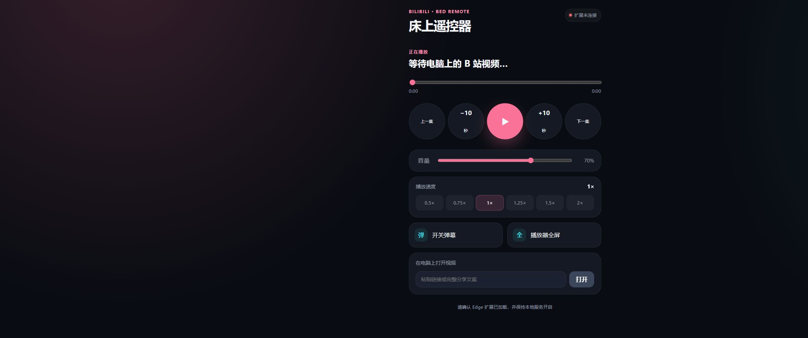

# B站床上遥控器

在同一个 Wi-Fi 下，用安卓手机遥控 Windows Edge/Chrome 中正在播放的哔哩哔哩视频。所有通信只在局域网内进行，不使用云服务器。

## 界面预览



## 已实现

- 播放、暂停、快进/快退 10 秒
- 拖动播放进度、音量与静音
- 0.5×—2× 倍速切换
- 上一集、下一集
- 弹幕开关、播放器全屏
- 手机显示视频标题、进度和播放状态
- 从手机发送 B 站链接到电脑
- 自动识别带标题的完整分享文案，例如 `【视频标题】 https://b23.tv/xxxx`
- 启动窗口显示二维码，手机扫码打开
- 支持安全配对模式和免配对模式

## 第一次安装 Edge 扩展

1. 在 Edge 地址栏打开 `edge://extensions`。
2. 打开左侧的“开发人员模式”。
3. 点击“加载解压缩的扩展”。
4. 选择本项目中的 `extension` 文件夹。

Chrome 的扩展页面是 `chrome://extensions`，其他步骤相同。

扩展文件更新后，需要在扩展管理页面点击一次“重新加载”，再刷新现有的 B 站视频标签页。

## 推荐：免配对启动

双击 `start-no-pairing.cmd`。启动窗口会显示手机访问地址和二维码，安卓手机直接扫码即可，不需要输入配对码。

免配对模式意味着：同一个局域网内知道访问地址的设备都可以控制播放器。建议只在可信的家庭 Wi-Fi 中使用。

正式入口始终是：

```text
http://电脑局域网IP:7331/
```

例如 `http://192.168.x.x:7331/`，不再需要添加 `?v=2`。

## 可选：配对码启动

如需限制其他局域网设备，双击 `start.cmd`。手机扫描二维码打开页面后，再输入窗口显示的六位配对码。

## 每天使用

1. 双击所需的启动脚本，保持黑色窗口开启。
2. 在 Edge 打开或刷新一个 B 站视频页面。
3. 手机扫描窗口中的二维码，或打开收藏的根地址。
4. 在“打开视频”输入框中，可以粘贴纯链接，也可以粘贴 B 站完整分享文案。

首次启动时，如果 Windows 防火墙询问是否允许访问，请只勾选“专用网络”。

## 安装依赖与开发检查

当前电脑已安装所需依赖。如果复制项目到另一台电脑，先在项目目录运行：

```powershell
npm install
```

检查命令：

```powershell
npm run check
npm test
```

如果 B 站更新页面结构，播放、进度、音量和倍速通常仍能工作；“上一集”“弹幕”和“播放器全屏”可能需要同步更新扩展里的页面选择器。
